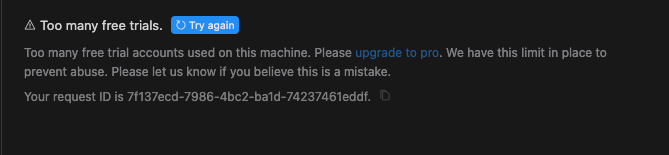

# Cursor-Too-many-free-trials
!Too many free trials. Too many free trial accounts used on this machine. Please upgrade to pro. We have this limit in place to prevent abuse. Please let us know if you believe this is a mistake.




出现问题的原因，使用太多次免费次数了，换了新的邮箱注册也没用。因为你的设备被标记了。解决思路就是修改Cursor记录的机器码。

用MacOS系统为例，其他系统找到storage.json文件后修改方法是一样的。


### MacOS下的处理步骤：

​	- 1.关闭Cursor

​	- 2.找到~/Library/Application Support/Cursor/User/globalStorage/storage.json文件

​	- 3.替换相应ID

文件内找到
"telemetry.macMachineId": "按照格式替换原来的值，64位的16进制数组成的字符串",
  "telemetry.machineId": "按照格式替换原来的值，64位的16进制数组成的字符串",
  "telemetry.devDeviceId": "按照格式替换原来的值，uuid:8-4-4-4-16"
  替换之后保存。

```
// 示例数据

"telemetry.macMachineId": "a3f2b1c0d9e4f7a1b5c2d7e8f6a9b0c2d3e5f1a4c6d7b8e9f3a2b0d1c8e7f4a6",

"telemetry.machineId": "3f2a7d1e9c8b4a5d7f3e6c2a1b9d0c8f5e1b7d2a9c4f3b6d8e2a5c1b7f912369",

"telemetry.devDeviceId": "f9a0e8d3-0d5b-4a7e-bc76-62bcbdd63a1a",
```

```
AI中随机生成相应值的提示词：

帮我生成64位的16进制数组成的字符串，生成两条不一样的
帮我生成Mac系统中的UUID格式的字符串
```

​	- 4.重启Cursor
